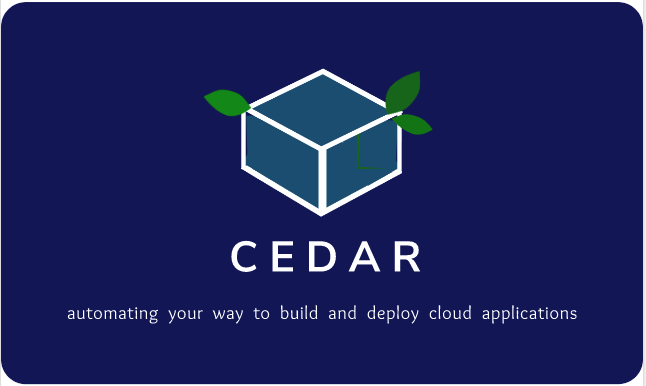

# Cloud Environment Definition And Reproduction (CEDAR)

<!--  -->

</a>
# Requirements
cloud packages like boto3
Ansible

# Example Deployments
From tools/lambda-gen/main_Deployer.py
```
python Main_DEPLOYER.py -L dev "test,stage" * ENVR.yaml API_Name true
```
The above will deploy all "*" -L (lambdas) from 'dev' to 'test' then 'stage' environments as defined in ENVR.yaml file mappings, specific to "API_Name" gateway configuration and to replace "true" prior configurations.
```
python Main_DEPLOYER.py -L dev "test,stage" lambdaNameHere ENVR.yaml API_Name truetrue
```
The above will deploy a single cloud function named "lambdaNameHere"
```
python Main_DEPLOYER.py -G dev "test,stage" users[*] ENVR.yaml API_Name true
```
The above will deploy -G (API-Gateway,resource,method) named "users" with all methods " \[ * \] ". 
```
python Main_DEPLOYER.py -DY dev "test,stage" xx_tablename ENVR.yaml API_Name true
```
The above will deploy -DY (dynamo table) named "xx_tablename" this includes PKs, SKs, LSIs and GSIs  all triggers/streams associated with the table. 

# Environment specific Unit tests
You can test your cloud functions in their native habitat, with "pre", "run", "assert" and "post" capabilities.  [REMOTE METHOD TEST](/tools/testing)


# Ansible (LIBS)

#### Ansible, used to deploy, configure and define environments and appliances for any application. [POWER OF ANSIBLE](https://www.ansible.com/application-deployment)

## PLAYBOOKS

#### Dynamic company playbooks, like aws and azure are found in [roles](/tree/master/ansible/roles) directory. To reference said scripts make sure you follow the structure for configuration in your own "role" defaults/main.yml and then include the library , in <role>/tasks/main.yml, like so :#\$

```
- include: ../aws/sts.yml project={{ project }}
- include: ../aws/ec2.yml project={{ project }}
```

** the above containts both sts and ec2 playbooks and you can find an example of usage/structure under roles/hello_world **

## MODULES

#### Custom CEDAR ansible modules can be found in the [library](/ansible/library) directory. To reference said scripts make sure you follow the examples found in each script, like so:

```
- name: dynamo cd import DATA from FILE import all on level
  cd_dynamo_set:
    aws_access_key: "{{ access }}"
    aws_secret_key: "{{ secret }}"
    security_token: "{{ token }}"
    region: "{{ project.region }}"
    table_name: "{{ item.name }}"
    level: "{{ item.level }}"
    recurse: "{{ item.recurse }}"
    load_from: "{{ item.load_from }}"
    target_env_value: "{{ item.target_env_value }}"
    playbook_dir: '{{ playbook_dir }}'
```

** the above assumes configuration file is used <role>/defaults/main.yml **

