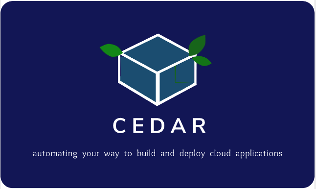

# Cloud Environment Definition And Reproduction (CEDAR)

<!--  -->

</a>

# Ansible (LIBS)

#### Ansible, used to deploy, configure and define environments and appliances for any application. [POWER OF ANSIBLE](https://www.ansible.com/application-deployment)

## PLAYBOOKS

#### Dynamic company playbooks, like aws and azure are found in [roles](/tree/master/ansible/roles) directory. To reference said scripts make sure you follow the structure for configuration in your own "role" defaults/main.yml and then include the library , in <role>/tasks/main.yml, like so :#\$

```
- include: ../aws/sts.yml project={{ project }}
- include: ../aws/ec2.yml project={{ project }}
```

** the above containts both sts and ec2 playbooks and you can find an example of usage/structure under roles/hello_world **

## MODULES

#### Generic company module scripts can be found in the [library](/Ansible_Deployer/ansible/library) directory. To reference said scripts make sure you follow the examples found in each script, like so:

```
- name: dynamo cd import DATA from FILE import all on level
  cd_dynamo_set:
    aws_access_key: "{{ access }}"
    aws_secret_key: "{{ secret }}"
    security_token: "{{ token }}"
    region: "{{ project.region }}"
    table_name: "{{ item.name }}"
    level: "{{ item.level }}"
    recurse: "{{ item.recurse }}"
    load_from: "{{ item.load_from }}"
    target_env_value: "{{ item.target_env_value }}"
    playbook_dir: '{{ playbook_dir }}'
```

** the above assumes configuration file is used <role>/defaults/main.yml **

# Vagrant CdCi (Setup)

Install vagrant for your OS:

- [Vagrantup.com](https://www.vagrantup.com/downloads.html)
- add vbguest plugin:

```bash
vagrant plugin install vagrant-vbguest
```

Vagar command to build, must be in same dir as Vagrant file:

```bash
vagrant up
```

or

```bash
vagrant up <your definition node>
```

Destroy previous builds:

```bash
vagrant destroy
```

or

```bash
vagrant destroy <your definition node>
```

# Once requirements are met build DOCKER

- vagrant ssh linux
- cd inside /docker
- then run:

```bash
docker build .
```

the "docker build ." file will run the ansible commands automatically

- Run commands from docker:

```bash
sudo docker exec 665b4a1e17b6 echo 'test this'
```

- Command prompt in docker:

```bash
sudo docker exec -i -t 665b4a1e17b6 /bin/bash #by ID
```

```bash
docker exec -it --privileged=true --user="root" e9bab2fed632 /bin/bash
```

Make sure pip is insalled:

```bash
apt-get install python-setuptools python-dev build-essential
easy_install pip
```

### Issue Resolution:

Failure commonly due to Older version of Vagrant or VirtualBox:
https://www.virtualbox.org/wiki/Downloads

if using vagrant 1.8.7 and on mac osX you may get metadata error with windows box.
remove the embeded curl to avoid OS level conflicts:

```bash
sudo rm /opt/vagrant/embedded/bin/curl
```
