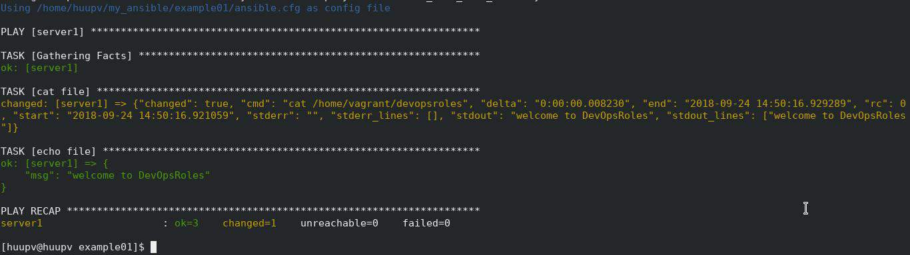

# CEDAR testing tools

## Summary

Services on amazon are not always easy to unit test within the context of the cloud. With CEDAR's testing tools it is now easier to do so.

### Lambda

With lambdas simply add your ".cedar." test files to the root of your lambda project files. if you have dependencies add them to a folder like "files". When ready "deploy" the lambda to AWS and thats it!!. (\* you can add as many test files as you like)

### Lambda Simple Example

following ".cedar." file will allow you to invoke a lambda and look for results with corresponding value:

```
---
run:
  action: invoke
  service: lambda
  target: CD-yourlambda
  environ_override:
    var1: var1_value
    var2: var2_some_other_value
  payloads:
    - files/test001.json
    - files/test002.json
  result:
    key: success
    value: true
```

In the exmample above four events will take place:

1. "var1" and "var2" will be modified/added with respective values
2. a lambda "CD-yourlambda" will execute
3. the lambdas result will be compared against the value in given key.
4. any modifications will be restored, as original, once the invocation completes or fails.

## Lambda advanced example

the following ".cedar." file will contain additional states including [pre,run,assert,post] these states will always execute in order.

```
---
pre:
  action: upload
  service: s3
  bucket: yourS3buckethere
  target: v3/testupload
  files:
    - files/test001.pdf
    - files/test002.pdf
run:
  action: invoke
  service: lambda
  target: CD-yourlambda
  environ_override:
    var1: var1_value
    var2: var2_some_other_value
  payloads:
    - files/test001.json
    - files/test002.json
  result:
    key: success
    value: true
assert:
  action: get
  service: s3
  bucket: yourS3buckethere
  target: prefolder/anotherfolder
  local_path: '.'
  files:
    - test001_final.png
    - test002_final.png
post:
  action: delete
  service: s3
  bucket: yourS3buckethere
  files:
    - prefolder/anotherfolder/test001.pdf
    - prefolder/anotherfolder/test001_final.png
    - prefolder/anotherfolder/test002.pdf
    - prefolder/anotherfolder/test002_final.png
```

Important to note that in the above example each state has an "service" and "action" its crucial that these are part of the CEDAR offerning to work correctly.
The states above will result in the following:

1. files are uploaded to s3
2. lambdas will execute
3. an assertion will be made on the existance of the s3 files
4. files listed will be deleted.

#

## CI/CD integration

If using Jenkins or other Automation tools dependencies required:

- Python 3
- [boto3](https://boto3.amazonaws.com/v1/documentation/api/latest/index.html)
- [Ansible](https://docs.ansible.com/ansible/latest/installation_guide/intro_installation.html)

###

These tests are ran using the following command from CEDAR:

```
python main_tester.py -L dev "CD-yourlambda" ENVR.yaml
```

Breakdown of above command:

- -L designates "lambda" service [REQUIRED]
- "dev" is the environment defined in your ENVR.yaml file [REQUIRED]
- the "lambda" or lambda(s) to test against if more than one use comma delimited value like _"lambda1,lambda2,lambda3"_ [REQUIRED]
- ENVR.yaml is your environment file that holds information about the environments needed. [REQUIRED]
- alias name can be used if you plan on running more than one lambda at a time. [OPTIONAL]

internally CEDAR will invoke to run the playbook:

```
ansible-playbook
```

## Results (Pass/Fail)

results are provided as standard Ansible outputs with "PLAY RECAP"

</a>
